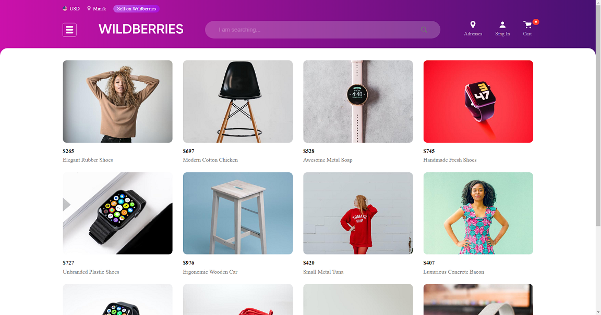

# Online-store


## Description
This project is a web store. The design bases on Wildberries. Project supports basic web store functionality: showcase with product descriptions, product categories, product search, shopping cart, authorization and registration.

## Basic characteristics
* The user can select a product on the main page, go to a particular category or find a product by its name
* When user hover cursor over the product image, there appear button to get more information about the product. When user click this button, a modal window open with a description and a button to add product to cart.
* You can add more quantity of product to your cart. The price calculator will show the total cost.
* To make an order, the user must be logged in.
* After registeration or logging in, the user page becomes available. This page contains information about the user and the button to log out.

## Installing
To work with code, clone or download this repository.
Then open root directory and run next command to install npm packages:
```sh
npm i
```
To build appilcation run
```sh
npm build
```
To run dev mode run
```sh
npm start
```

## API
This application uses a [third party application](https://github.com/1Alisa1/store-api) that provides an API for working with products. To work, the API application must be running on the same machine and listening on port 8080.

## Technologies
* [React](https://github.com/facebook/react)
* [React Router](https://github.com/remix-run/react-router)
* [React Hook Form](https://github.com/react-hook-form/react-hook-form)
* [Redux Toolkit](https://github.com/reduxjs/redux-toolkit)
* [TypeScript](https://github.com/microsoft/TypeScript)
* [Sass](https://github.com/sass/sass)
* [Firebase](https://firebase.google.com/)
